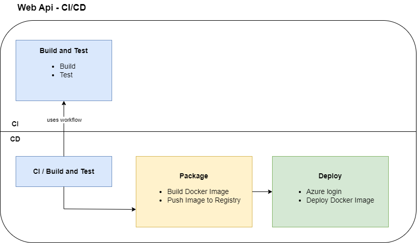

# Generic App - *a monorepo's tale*

A generic app without any use case.  
The main purpose of this project is to create a monorepo with multiple apps where each app can be deployed indenpendently.  

Every deployable software in this repo gets a unique human-readable identifier that I call **technical-id**.  
Right now, there are two of them **web-api** and **client-app**.

**client-app** is a SPA created with vite + vue.js.  
Link: <https://genericapp.z6.web.core.windows.net/>

**web-api** is a rest api that works as backend for the client-app and is backed by NestJS.  
Link: <https://api-generic-app.azurewebsites.net/>

## Directory Structure

### Basic Strcuture

```bash
├───.github
│   └───workflows
├───apps
│   └───client-app
├───services
│   └───web-api
├───package.json
└───ReadMe.md
```

The root directory's package.json contains the [workspaces](https://docs.npmjs.com/cli/using-npm/workspaces) for all apps in this repo.

### apps

All fronted apps are placed there. In my case there is only one vue app, but if you work on a larger project you may have many client apps for different platforms like web, ios, windows and so on.  
The app's directory name is important, it must be named after the **technical-id**, more on that later.

### services

By services I mean all sorts of software that users aren't facing.
This could be for example rest apis, worker services and serverless functions.  
Here, too, it is import to use the **technical-id** as directory name for your service.

## Continuous Integration

I thought one challenge is to run different ci pipelines for different projects, but it turned out that's actually easy to achieve.  
*Github Actions* provides path filters on pipeline triggers.  
For instance, all pushes that contain changes in `apps/client-app` will trigger the workflow *Client App - Continuous Integration*.

```yml
  push:
    branches: [ "**" ]
    paths: 
      - 'apps/client-app/**'
```

In this way, frontend devs can work on their client app and push their changes without triggering other CI workflows.

You'll find the whole worklfow in [.github/workflows/client-app-ci.yml](.github/workflows/client-app-ci.yml)

## Continuous Deployment

For simplicity's sake I have only one deployment environment that is **Production**. There is no **Staging**, **QA**, **Testing** or **Bugfixing** environment.

### How to deploy?

Deplyoments get triggered by `git tags`, you can use both **leightweight** and **annotated** tags.  

The simplest way to deploy a project is using a *lightweight tag* that's name follows the  
convention `<technical-id>@<version>`, e.g.

 ```bash
 # lightweight tag
 git tag 'web-api@1.2.3'

 # or an annotated tag
 # git tag -a 'web-api@1.2.3' -m "message goes here ..."

 git push --tags
 ```

The deployment workflow starts only if the tag name matches the pattern in [.github/workflows/web-api-cd.yml](.github/workflows/web-api-cd.yml)

```yml
  push:
    tags: ['web-api@*']
```

### Client App (client-app)

Since the client-app is just static content that needs to be served I can use an Azure Blob Storage to do this.  
[Static website hosting in Azure Storage](https://learn.microsoft.com/en-us/azure/storage/blobs/storage-blob-static-website)


### Web Api (web-api)

This service is deployed as a docker container and runs in Azure as Web App.  
*Github Packages* is a good fit as container registry.



## TODO

### Package Sharing

The web-api creates already a typescript client for its endpoints.
By running `npm run generate-ts-client` the generated file will be placed in [./services/web-api/clients](./services/web-api/clients).  
Find a way to share this client with the client-app without using a package manager like npm.
